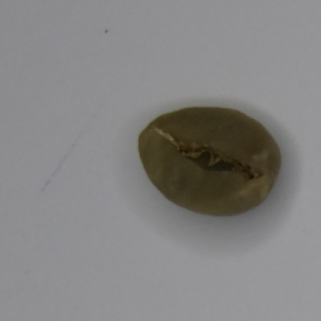
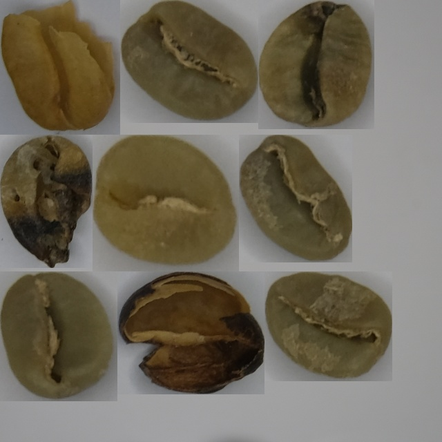

# 🧩 Mosaic-Packed (Object Mosaic Generator)

A specialized tool designed to create dense, packed mosaics from individual object instances. It automates the process of cropping objects from existing datasets and arranging them efficiently onto a single canvas while maintaining accurate YOLO-format labels.

## 🚀 Key Features
- **Tight Object Cropping**: Automatically extracts objects from source images using YOLO bounding boxes.
- **Dynamic Packing Logic**: Smartly arranges objects into rows to maximize canvas usage.
- **YOLO Integration**: Generates updated `.txt` labels for the final mosaic, mapping original classes to their new positions.
- **Background Customization**: Supports custom background images or fallback solid colors.
- **Progressive Generation**: Includes a looping mechanism to generate large batches with varying object sizes.

## 📂 Project Structure
```text
Mosaic-Packed/
├── sample/
│   ├── images/     # Source images (.jpg)
│   └── labels/     # Corresponding YOLO labels (.txt)
├── background/     # Background images for the mosaic
├── result/
│   ├── images/     # Output mosaics
│   └── labels/     # Updated labels for mosaics
└── mosaic_packed.py # Core logic
```

## 🛠️ Requirements
- `opencv-python`
- `numpy`
- `glob`
- `random`

## 👁️ Preview

| Input (single cropped object) | Output (packed mosaic) |
:-----------------------------:|:-----------------------:
 | 

## 🕹️ Usage
1. Place your source images and labels in the `sample/` folder.
2. Provide a background image in the `background/` folder.
3. Run the script:
   ```bash
   python mosaic_packed.py
   ```
4. Find your generated mosaics in the `result/` directory.

## 🔗 Related Projects

- [Auto-Image-Labeling](https://github.com/dzakyalfitra/Auto-Image-Labeling) — Automated bounding box label generation using OpenCV and Otsu's thresholding, with YOLO-format export.
- [Image-Splitter](https://github.com/dzakyalfitra/Image-Splitter) — Image splitting utility for preprocessing and dataset preparation.

---